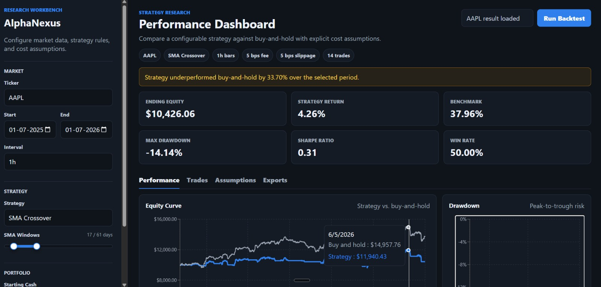
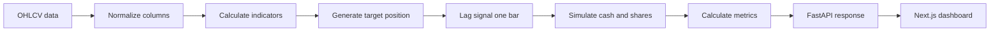

# AlphaNexus

AlphaNexus is a full-stack backtesting workbench for comparing simple, explainable trading rules with buy-and-hold.


[](https://github.com/TJA0308/AlphaNexus/actions/workflows/ci.yml)

[Live dashboard](https://alpha-nexus-mbbqka99o-tja0308s-projects.vercel.app/) | [API documentation](https://alphanexus-api.onrender.com/docs) | [Deployment notes](docs/deployment.md)



## Why I built it

I wanted to understand what happens between a trading idea and the performance number shown at the end of a backtest. A notebook can calculate a return quickly, but it can also hide important details: when a signal becomes tradable, how transaction costs are applied, what happens to cash and shares, and whether the comparison with buy-and-hold is fair.

I built AlphaNexus to make that pipeline inspectable. Market-data loading, indicators, signal generation, portfolio simulation, metrics, API serialization, and frontend rendering live in separate layers. The application is intentionally small enough that I can explain and test each one.

This is a research and education tool, not a trading system or a claim that these strategies generate alpha.

## What it does

- Downloads historical OHLCV data with `yfinance`.
- Runs SMA crossover, RSI mean-reversion, and Bollinger breakout strategies.
- Simulates a long-only portfolio with configurable fees, slippage, and starting capital.
- Compares the strategy with buy-and-hold over the same period.
- Reports return, Sharpe ratio, drawdown, trade count, win rate, and ending equity.
- Displays equity, drawdown, assumptions, and executed trades in a Next.js dashboard.
- Exports the full equity curve and trade ledger as CSV.
- Stores completed run summaries in SQLite.

## How a backtest moves through the system



The analytics code does not depend on either UI. The same engine is used by the FastAPI/Next.js application and the optional Streamlit interface.

## Decisions that matter

### Signals execute one bar later

An indicator calculated from bar `t`'s close cannot also trade at that same close. Strategy targets are shifted by one bar before trades are generated, so information observed at `t` is acted on at `t+1`.

This was a correctness issue in an earlier version of the project. Fixing it changed the simulation results, and a regression test now protects the behavior.

### The engine is deliberately long-only

The portfolio holds cash or one long position. That keeps position state, fees, realized PnL, and trade records easy to audit. Short selling, leverage, and multi-asset allocation would require additional margin and risk rules rather than just another UI control.

### Benchmarks use cached data

Network timing and upstream data changes make live downloads unsuitable for regression benchmarks. The benchmark suite therefore uses eight deterministic OHLCV fixtures across three date windows and three strategies: 72 scenarios in total.

### Interfaces are separate from the model

FastAPI validates and serializes requests, while Next.js handles interaction and visualization. The Python package owns the calculations. This separation lets the test suite exercise the engine without starting a browser or web server.

## Strategies

| Strategy | Entry | Exit |
| --- | --- | --- |
| SMA crossover | Fast SMA rises above slow SMA | Fast SMA falls below slow SMA |
| RSI mean reversion | RSI falls below the oversold threshold | RSI rises above the overbought threshold |
| Bollinger breakout | Close rises above the upper band | Close falls below the center line |

All strategies produce a target position of `1` (long) or `0` (cash). The execution engine turns changes in that target into trades.

## Reproduce the dashboard example

The visible configuration in the screenshot uses:

| Input | Value |
| --- | --- |
| Ticker | `AAPL` |
| Strategy | `SMA Crossover` |
| Interval | `1h` |
| Start | `2025-07-01` |
| End | `2026-07-01` |
| SMA windows | `17 / 61` |
| Starting cash | `$10,000` |
| Fee | `5 bps` |
| Slippage | `5 bps` |

Run the configuration from the live dashboard. The result should render the performance metrics, equity and drawdown charts, executed trades, assumptions, and both CSV downloads. Exact values can change if the upstream provider revises its history.

## Repository layout

```text
alphanexus/
  data.py          Market-data loading and normalization
  indicators.py    SMA, RSI, and Bollinger Bands
  strategies.py    Indicator-to-position rules
  backtest.py      Portfolio and execution simulation
  metrics.py       Risk and performance summaries
  storage.py       SQLite run history
api/main.py        FastAPI routes and request models
frontend/app/      Next.js dashboard
benchmarks/        Deterministic fixtures and scenario runner
tests/             Indicator, engine, storage, and benchmark tests
app.py             Optional Streamlit interface
```

More detail is available in [docs/architecture.md](docs/architecture.md).

## API

```text
GET  /health       Service health
GET  /strategies   Supported strategy metadata
GET  /backtests    Recent run summaries
POST /backtests    Run a backtest and save its summary
```

Example request:

```bash
curl -X POST https://alphanexus-api.onrender.com/backtests \
  -H "Content-Type: application/json" \
  -d '{
    "ticker": "AAPL",
    "start": "2024-01-01",
    "end": "2024-12-31",
    "interval": "1d",
    "strategy": "sma_crossover",
    "starting_cash": 10000,
    "fee_bps": 5,
    "slippage_bps": 5,
    "allocation": 1,
    "fast_window": 17,
    "slow_window": 50
  }'
```

## Run locally

Python 3.11 or newer and Node.js 22 are recommended.

```bash
python -m venv .venv
.venv\Scripts\activate
pip install -r requirements.txt
uvicorn api.main:app --reload
```

In a second terminal:

```bash
cd frontend
npm install
npm run dev
```

The frontend runs on `http://127.0.0.1:3000` and the API on `http://127.0.0.1:8000`.

Optional interfaces:

```bash
streamlit run app.py
```

```bash
docker build -t alphanexus-api .
docker run -p 8000:8000 alphanexus-api
```

## Tests and benchmark

```bash
pytest
python benchmarks/run_backtest_benchmark.py
npm --prefix frontend run build
```

The deterministic benchmark currently covers:

```text
8 fixtures × 3 date windows × 3 strategies = 72 scenarios
```

CI runs the Python tests, enforces a conservative `100 ms` p95 engine threshold, builds the production frontend, and verifies the backend container through its health endpoint. Timing numbers vary by machine; the fixture matrix and correctness assertions are the reproducible evidence.

See [benchmarks/README.md](benchmarks/README.md) for the scenario definitions.

## Current boundaries

- Long-only, single-asset portfolios
- End-of-bar signals executed at the following bar's close
- Open positions are valued at the final close rather than forcibly liquidated
- No leverage, short selling, options, or portfolio optimization
- No walk-forward or out-of-sample parameter selection
- No market-impact or order-book model beyond configurable slippage
- Historical data supplied by `yfinance`
- SQLite history is ephemeral on hosts without a persistent disk

These boundaries make the application suitable for learning and comparing simple rules. They also mean its results should not be interpreted as evidence that a strategy would perform the same way in live trading.

## Possible next research steps

- Walk-forward evaluation and parameter-sensitivity analysis
- Adjusted-price and corporate-action policy
- Next-open execution and stronger fill assumptions
- Multi-asset portfolio construction
- Comparison against an external benchmark symbol

## License and disclaimer

This project is for research and education. It is not financial advice and does not predict future returns.
