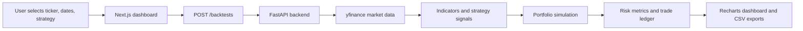

<div align="center">

# AlphaNexus

Full-stack strategy backtesting workbench for comparing simple trading rules against buy-and-hold benchmarks.

[](https://alpha-nexus-mbbqka99o-tja0308s-projects.vercel.app/)
[](https://alphanexus-api.onrender.com/docs)
[](https://github.com/TJA0308/AlphaNexus/actions/workflows/ci.yml)

<p><strong>Frontend</strong></p>


<p><strong>Backend & Analytics</strong></p>


<p><strong>Demo, Testing & Deployment</strong></p>


</div>

## Overview

AlphaNexus is a financial analytics application that lets a user configure a ticker, date range, strategy, starting capital, fees, and slippage, then runs a Python backtest and returns an interactive performance dashboard.

The goal is not to build a black-box trading bot. The goal is to make backtesting explainable: data loading, indicators, strategy signals, portfolio simulation, risk metrics, API responses, and frontend rendering are separated into clear layers.

## Live Links

| Surface | URL | Purpose |
| --- | --- | --- |
| Full-stack app | [Vercel deployment](https://alpha-nexus-mbbqka99o-tja0308s-projects.vercel.app/) | Main Next.js dashboard |
| API docs | [FastAPI Swagger docs](https://alphanexus-api.onrender.com/docs) | Test backend endpoints |
| API health | [Render health check](https://alphanexus-api.onrender.com/health) | Confirm backend is awake |
| Deployment notes | [docs/deployment.md](docs/deployment.md) | Render + Vercel setup |
| Architecture notes | [docs/architecture.md](docs/architecture.md) | Backend and analytics design |

## Features

| Area | Capability |
| --- | --- |
| Market data | Downloads historical OHLCV records with `yfinance` |
| Strategies | SMA crossover, RSI mean reversion, Bollinger breakout |
| Portfolio simulation | Tracks cash, shares, fees, slippage, realized PnL, and equity curve |
| Benchmarking | Compares strategy performance against buy-and-hold |
| Risk metrics | Total return, benchmark return, max drawdown, Sharpe ratio, win rate, trade count |
| UI controls | Radix dual-range SMA slider, numeric cost inputs, semantic tabs, config badges |
| Charts | Recharts equity curve and drawdown visualization |
| Exports | Trade ledger and equity curve CSV downloads |
| API | FastAPI endpoints for health, strategy metadata, and backtest execution |
| Testing | pytest coverage for indicators, backtest behavior, and 72-scenario benchmark regression |
| Benchmarks | Deterministic cached-fixture benchmark with median and p95 engine runtime |

## Product Flow



## Architecture

```text
Market data
  -> normalization
  -> indicators
  -> strategy signals
  -> portfolio simulation
  -> metrics
  -> FastAPI response
  -> Next.js dashboard
```

```text
.
|-- alphanexus/
|   |-- backtest.py       # Portfolio simulation engine
|   |-- data.py           # Market data loading and normalization
|   |-- indicators.py     # SMA, RSI, Bollinger Bands
|   |-- metrics.py        # Sharpe, drawdown, performance summary
|   `-- strategies.py     # Strategy signal generation
|-- api/
|   `-- main.py           # FastAPI app
|-- frontend/
|   `-- app/              # Next.js App Router dashboard
|-- benchmarks/           # Deterministic fixture benchmark suite
|-- tests/                # pytest coverage for core logic
|-- docs/                 # architecture and deployment notes
|-- app.py                # Streamlit backup demo
|-- render.yaml           # Render backend config
|-- requirements.txt
`-- pyproject.toml
```

## Tech Stack

| Layer | Tools |
| --- | --- |
| Frontend | Next.js App Router, TypeScript, Radix UI, Recharts |
| Backend API | FastAPI, Pydantic, Uvicorn |
| Analytics | Python, pandas, NumPy |
| Data source | yfinance |
| Backup demo | Streamlit, Plotly |
| Testing | pytest, GitHub Actions |
| Deployment | Vercel frontend, Render backend |

## Backtest Method

1. Load historical OHLCV data for the selected ticker.
2. Normalize provider output into a predictable schema.
3. Calculate indicators such as moving averages, RSI, or Bollinger Bands.
4. Convert indicators into long-only target positions.
5. Execute position changes while accounting for fees and slippage.
6. Build strategy equity and buy-and-hold benchmark curves.
7. Return metrics, drawdown, trade ledger, and exportable data.

## Assumptions

- Long-only portfolio: the simulator holds cash or one long position.
- Signals are generated from historical close prices.
- Fees and slippage are applied on executed trades.
- The benchmark is buy-and-hold over the same selected period.
- Results are for research and education, not financial advice.
- Historical data can change if the upstream provider revises records.

## Proof Test Case

Use this test case in the live app:

| Input | Value |
| --- | --- |
| Ticker | `AAPL` |
| Strategy | `SMA Crossover` |
| Interval | `1d` |
| Start | `2024-01-01` |
| End | `2024-12-31` |
| SMA windows | `17 / 50` |
| Starting cash | `10000` |
| Fee bps | `5` |
| Slippage bps | `5` |

Expected behavior:

- Metrics update after `Run Backtest`.
- Equity and drawdown charts render.
- Trades tab shows executed entries/exits or a clear empty state.
- Assumptions tab reflects the selected parameters.
- Exports tab provides CSV downloads.

## API Example

```bash
curl -X POST https://alphanexus-api.onrender.com/backtests \
  -H "Content-Type: application/json" \
  -d '{
    "ticker": "AAPL",
    "start": "2024-01-01",
    "end": "2024-12-31",
    "interval": "1d",
    "strategy": "sma_crossover",
    "starting_cash": 10000,
    "fee_bps": 5,
    "slippage_bps": 5,
    "allocation": 1,
    "fast_window": 17,
    "slow_window": 50
  }'
```

Main endpoints:

```text
GET  /health
GET  /strategies
POST /backtests
```

## Local Development

Install Python dependencies:

```bash
python -m venv .venv
.venv\Scripts\activate
pip install -r requirements.txt
```

Run the backend:

```bash
uvicorn api.main:app --reload
```

Run the Next.js frontend:

```bash
cd frontend
cmd /c npm install
cmd /c npm run dev
```

Optional Streamlit demo:

```bash
streamlit run app.py
```

## Testing

Run backend tests:

```bash
pytest
```

Build frontend:

```bash
cmd /c npm --prefix frontend run build
```

CI runs both checks on pushes and pull requests to `main`.

## Benchmarking

Run the deterministic backtest benchmark:

```bash
python benchmarks/run_backtest_benchmark.py
```

Example local result:

```text
Scenarios passed: 72/72 (100.0%)
Fixture rows processed: 24,120
Median engine runtime: 13.71 ms
P95 engine runtime: 20.85 ms
```

The benchmark uses cached synthetic OHLCV fixtures instead of live `yfinance` downloads, so it measures the simulation engine rather than network or provider latency. Local timing can vary between runs, so the CI guard enforces a conservative `100 ms` p95 threshold. See [benchmarks/README.md](benchmarks/README.md) and [docs/project-defense.md](docs/project-defense.md).

## What This Demonstrates

<details>
<summary><strong>Software engineering</strong></summary>

- Modular backend package design
- Typed FastAPI request/response models
- Frontend/backend separation
- Deterministic benchmark and regression suite
- Deployment configuration for Render and Vercel
- CI checks for Python tests and frontend builds

</details>

<details>
<summary><strong>Data and analytics</strong></summary>

- Market data normalization
- Vectorized indicator calculations
- Portfolio state simulation
- Benchmark comparison
- Risk and performance metrics

</details>

<details>
<summary><strong>Product thinking</strong></summary>

- Clear assumptions instead of vague trading claims
- Exportable evidence for results
- Config badges and semantic tabs
- A proof test case that recruiters/interviewers can reproduce

</details>

## Interview Explanation

> I built AlphaNexus to understand how analytics products work end to end. The backend fetches market data, computes indicators, generates strategy signals, simulates a portfolio with fees and slippage, and returns risk metrics through FastAPI. The frontend lets a user configure a strategy and inspect the equity curve, drawdown, benchmark comparison, trade ledger, assumptions, and CSV exports.

## Resume Bullet

> Built a full-stack backtesting platform that validates 72 reproducible strategy scenarios with 100% pass rate and sub-30 ms p95 engine runtime locally, by creating cached OHLCV fixtures, a benchmark scenario matrix, and regression tests around a Python/FastAPI analytics engine.

## Roadmap

- Add screenshots and GIF walkthroughs to this README.
- Add saved backtest history with SQLite or DuckDB.
- Add walk-forward testing to reduce overfitting.
- Add multi-asset portfolio allocation.
- Add Playwright tests for the deployed frontend flow.
- Add Dockerfiles for consistent local and cloud deployment.

## Disclaimer

This project is a research and education tool. It is not financial advice, and it does not predict future returns.
